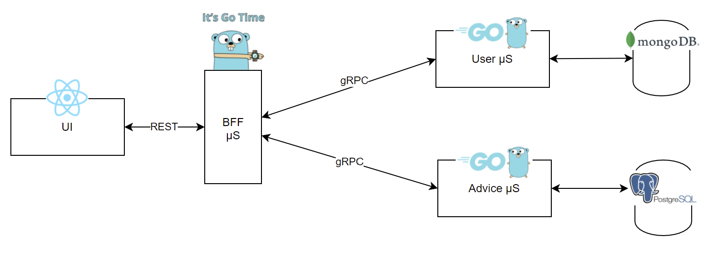
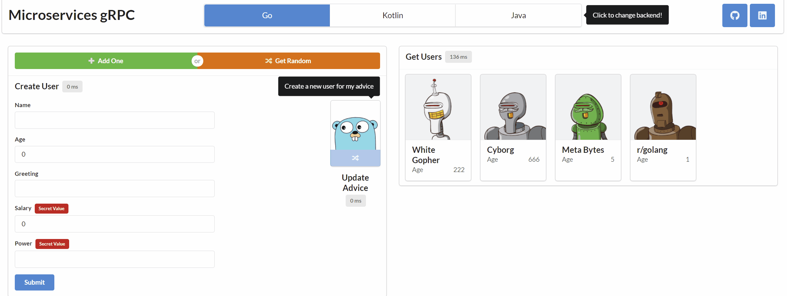

# Backend for Frontend (BFF) Microservices Go gRPC

This repo contains microservices written in Go which aims to demonstrate BFF pattern by performing distributed CRUD operations.






## Installation
Clone the repository
```bash
git clone https://github.com/fazamuttaqien/bff-grpc-go.git
```

You should have Docker installed beforehand.

`.env` is included. You just need to create network & execute `docker-compose` command

```bash
docker network create uid4oe
docker-compose up -d
```

At this point everything should be up and running! You can access to UI at 

```bash
http://localhost:5173
```

Additionally, you may take a look at [Microservices gRPC UI](https://github.com/fazamuttaqien/microservices-grpc-ui/) for the UI code.

## Local Development
For running services in local environment, you will need a MongoDB & PostgreSQL instance, you can use `local.yml`
It will set up MongoDB, PostgreSQL and UI.

```bash
docker network create ms-grpc-network
docker compose --file docker/docker-compose-local.yml up -d
```

Now lets start microservices locally.
```bash
bash script/start-local.sh
```
or 
```bash
script/start-local.bat
```

That's great. Now we can use the app through UI at

```bash
http://localhost:3000
```


